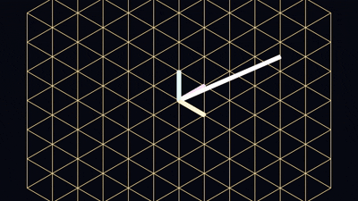

# 🌌 Basis Translator 3D
### Project 03 — Change of Basis Visualizer

> *"The vector doesn't move. The coordinate system does."*


---

## 🎬 Cinematic Renders — 1920×1080 · 60fps · EEVEE

| Standard Basis | Rotated Z 45° |
|:---:|:---:|
|  |  |
| Ghost + alien lattices overlap at identity | Gold lattice morphs 45° — white anchor stays fixed |

| Stretched | Tilted (Crystal Lattice) |
|:---:|:---:|
|  |  |
| X stretched 2×, Y squished 0.5× | Axes no longer at 90° — skewed space |

---

## 🧠 The Core Insight

```
The white arrow (ANCHOR_VEC) never moves a single pixel.

The gold lattice starts at identity (same as standard),
then morphs into the alien basis orientation.

After the morph:
  Standard sees the point as [2.0, 2.0, 1.5]
  Alien sees the SAME point as [x', y', z']  ← different numbers, same location
```

This is **Change of Basis** — the same physical reality described in a different coordinate language.

---

## 🔬 The Math

```
P        = The alien basis matrix (columns = alien's axes in standard coords)
P⁻¹      = The inverse — portal from standard → alien
P⁻¹ @ v  = "What does the alien see?" for vector v

The Similarity Transform (God-Mode Equation):
P⁻¹ @ M @ P = Apply M, but relative to the alien's coordinate system
```

---

## 🌌 The 4 Universes

```
standard    → Identity — ghost and alien overlap perfectly
rotated_z45 → Alien rotated 45° around Z — alien thinks "Forward" is diagonal
stretched   → Alien X is 2× longer, Y is 0.5× — anisotropic space
tilted      → Crystal lattice — axes no longer orthogonal
```

---

## 🏗️ Architecture

```
Phase_1_Logic/
├── matrices.py      ← 4 basis matrices (P) + 4 action matrices (M)
└── basis_utils.py   ← express_in_basis(), back_to_standard(), similarity_transform()

Phase_2_Blender/
├── scenes/
│   └── transform.py    ← Entry point — set ALIEN_BASIS and run
└── utils/
    ├── materials.py    ← Dual palette: ghostly standard + glowing alien + white anchor
    ├── scene_builder.py← build_lattice(name, ...) — builds 2 overlapping lattices
    └── animator.py     ← Shape Keys morph alien lattice into true orientation
```

---

## 🚀 Quick Start

```
1. Open Blender 5.x
2. Scripting tab → Open → Phase_2_Blender/scenes/transform.py
3. Set ALIEN_BASIS = "rotated_z45"  (or stretched / tilted / standard)
4. ▶ Run Script
5. Render → Render Animation  (Ctrl+F12)
```

Terminal prints the translation report automatically:
```
🌌 DIMENSIONAL TRANSLATION REPORT
Physical Location (Standard):      [2.  2.  1.5]
Alien Coordinates (rotated_z45):   [2.828 0.    1.5  ]
```

---

## 📐 Part of the Simulation Architect Path

| # | Project | Status |
|---|---|---|
| 01 | 2D Linear Transform Animator | ✅ Complete |
| 02 | 3D Linear Transform Animator | ✅ Complete |
| **03** | **Basis Translator 3D** ← *here* | ✅ Complete |
| 04 | Geometric Linear System Solver | ⏳ |
| 05 | Eigenvector Explorer | ⏳ |
| 06A | Solar System Simulator | ⏳ |
| **06B** | **PROJECT VOID** | ⏳ |
| 07 | Neural Network Visual Simulator | ⏳ |
| 08 | Optical Fiber Simulator | ⏳ |
| 09 | VOID AI — RL Navigator | ⏳ |
| 10 | Omniverse Digital Twin | ⏳ |

---

## 👨‍💻 Author

**Divyansh Ailani** — Simulation Architect in progress

*BCA Student · Kanpur, India → The World*

> "Mathematics is the language of the universe. I am learning to read it."

[](https://www.linkedin.com/in/divyansh-ailani-225925380/)
[](https://github.com/divyanshailani)

---

*Part of the **Simulation Architect Path** — from linear algebra to NVIDIA Omniverse. 🌌*
